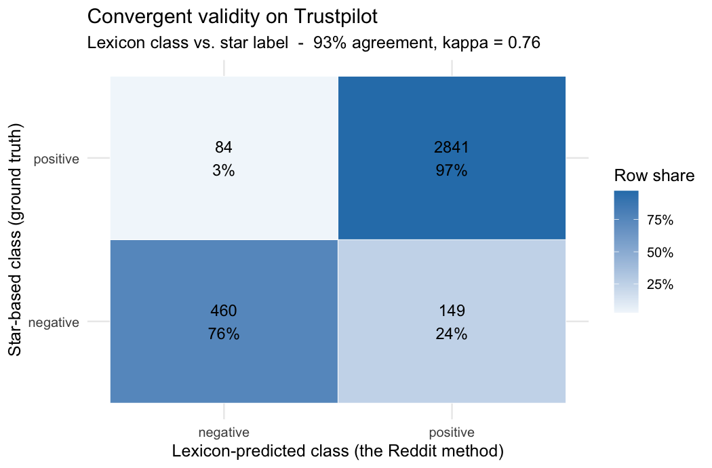
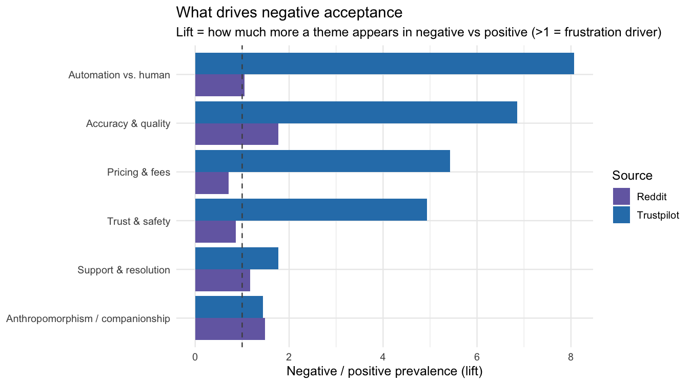
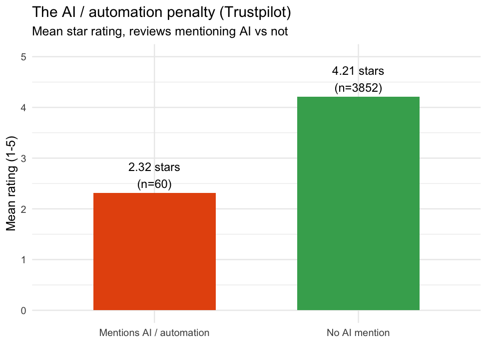

```{r setup, include=FALSE}
knitr::opts_chunk$set(echo = FALSE, warning = FALSE, message = FALSE,
                      fig.align = "center")
suppressPackageStartupMessages({ library(dplyr); library(knitr) })

safe_read <- function(p) if (file.exists(p))
  tryCatch(read.csv(p, stringsAsFactors = FALSE), error = function(e) NULL) else NULL
fmt_range <- function(d) {
  d <- suppressWarnings(as.Date(d)); d <- d[!is.na(d)]
  if (!length(d)) return("n/a")
  paste(format(min(d), "%b %Y"), "--", format(max(d), "%b %Y"))
}

rd <- safe_read("data/reddit_baseline.csv")        # Reddit discussion baseline
tp <- safe_read("data/trustpilot_flagged.csv")     # Trustpilot + ai_related flag
ai <- safe_read("data/ai_experience.csv")          # Trustpilot AI subset

# Step-5 (this report's analysis layer) outputs
s5 <- safe_read("outputs/step5_metrics.csv")
dc <- safe_read("outputs/design_cards.csv")
dw <- safe_read("outputs/negativity_drivers_wide.csv")
rg <- safe_read("outputs/role_gradient.csv")
getm <- function(k) { if (is.null(s5)) return("n/a")
  v <- s5$value[s5$metric == k]; if (length(v)) as.character(v[1]) else "n/a" }

if (!is.null(rd)) {
  rd_n <- nrow(rd); rd_subs <- length(unique(rd$subreddit))
  rd_dates <- fmt_range(rd$date)
  rd_cat <- rd |> count(platform_category, name = "Comments") |> arrange(desc(Comments))
  top_subs <- rd |> count(subreddit, sort = TRUE) |> head(6)
  top_str <- paste(sprintf("r/%s (%d)", top_subs$subreddit, top_subs$n), collapse = ", ")
}
if (!is.null(tp)) {
  tp_n <- nrow(tp); tp_dates <- fmt_range(tp$date_posted)
  tp_ai_n <- sum(tp$ai_related, na.rm = TRUE)
}
```

# The idea and research question

Online services increasingly put **AI and AI agents** between the user and the
thing they came for: chatbots answer support tickets, algorithms screen and
price, automated systems make decisions. We study **how people accept (or
reject) that AI** --- and, crucially, how acceptance changes with the *role* AI
plays. We compare three service contexts:

- **AI-native services** --- the product *is* an AI agent (ChatGPT, Claude,
  Replika, Gemini, Perplexity);
- **Peer-to-peer rentals** --- AI is a *peripheral* automation layer on a human
  marketplace (Turo, Airbnb);
- **Customer service** --- AI runs the *support* layer (chatbots replacing
  agents).

The middle context is the assignment's heart --- a **peer-to-peer sharing
economy** for high-value professional gear: cameras and drones (Fat Llama),
photography lenses (Lensrentals), film and event kit (KitSplit), vehicles (Turo,
Getaround) and RVs (Outdoorsy, RVshare) --- while the AI-native and
customer-service contexts act as comparison lenses that reveal how acceptance
shifts as AI moves from *being* the product, to a marketplace add-on, to the
support desk.

> **Research question.** How do users accept and experience AI agents across
> different service platforms --- and what drives or erodes trust as AI moves
> from being the product, to a marketplace add-on, to the support desk?

We use two complementary corpora. **Reddit is the discussion baseline** ---
open deliberation where users describe AI experiences in their own words.
**Trustpilot is the verification layer** --- reviews carrying a **1--5 star
rating** that acts as a ground-truth acceptance label. Where the open
discussion and the labelled reviews agree we gain confidence; where they
diverge we learn something real.

# Data in brief

**Reddit (`reddit_baseline.csv`).** `r format(rd_n, big.mark=",")` comments
across `r rd_subs` subreddits (`r rd_dates`), pulled from the **Arctic Shift**
research archive (`01_fetch_reddit_arcticshift.R`) because Reddit's 2026
anti-bot wall blocks live scraping. AI-native subreddits are pulled in full;
rental and support subreddits by AI/automation keyword search. Each comment is
tagged with a `platform_category`: ai\_service `r rd_cat$Comments[rd_cat$platform_category=="ai_service"]`,
rental `r rd_cat$Comments[rd_cat$platform_category=="rental"]`,
customer\_service `r rd_cat$Comments[rd_cat$platform_category=="customer_service"]`.
Top subreddits: `r top_str`.

**Trustpilot (`trustpilot_flagged.csv`).** `r format(tp_n, big.mark=",")` reviews
from seven peer-to-peer rental platforms (Apify actor
`casper11515/trustpilot-reviews-scraper`, merged by `02_merge_trustpilot.R`),
each with a 1--5 star label. `06_ai_acceptance.R` flags the
**`r tp_ai_n` reviews that describe an AI / automation experience** (bots,
algorithms, automated decisions, "no human").

# Method

The pipeline runs in five steps. **Steps 1--4** (`steps 1 to 4.R`) operate on the
Reddit baseline: (1) **preprocessing** --- clean, lowercase, stop-word removal,
lemmatisation, and a two-class split (positive vs negative) from lexicon
sentiment; (2) **exploratory** --- top-10 words per class, commonality and
comparison word clouds (1- and 2-gram); (3) **structural & sentiment** ---
bigram co-occurrence network and an NRC emotion comparison; (4) **modelling** ---
LDA topics per class (1- and 2-gram) and GloVe embeddings for the neighbours of
*trust*, *bot*, *host*.

**Step 5** (`05_integration.R`, this report) is the synthesis layer. It brings in
Trustpilot and fuses the two sources three ways: a **convergent-validity test**
of the Reddit method against real stars, a **shared theme lexicon** applied to
both corpora, and the **AI-role gradient**. For portability it uses the bundled
Bing lexicon (sign-of-sum, the same two-class logic as the AFINN classing in
steps 1--4) and base-R I/O, so it runs with no downloads.

# Findings: integrating the two sources

The brief asks how the **word networks, sentiments, and topics overlap to tell a
cohesive story**. They do, and Trustpilot lets us prove it rather than assert
it. The negative-class structures that steps 1--4 surface on Reddit --- the
co-occurrence hubs around *bot* / *human* / *support*, the negative-leaning NRC
emotions, and the LDA topics about automation and unresolved problems ---
reappear as the themes that drive **low star ratings** on Trustpilot. Three
results carry the story.

## The Reddit method is valid: lexicon sentiment tracks real stars

Reddit has no ground-truth label, so steps 1--4 *infer* the positive/negative
class from a sentiment lexicon. Is that inference trustworthy? Trustpilot is the
only source with **both** a lexicon score and a real star rating, so it is where
we can test it. Applying the identical lexicon class to Trustpilot text and
comparing it to the star-based class gives
**`r getm("validity_agreement_pct")`% agreement** (Cohen's
$\kappa$ = `r getm("validity_kappa")`, n = `r format(as.numeric(getm("validity_n")), big.mark=",")`;
Figure 1) --- *substantial* agreement by the usual benchmark. The lexicon
recovers 76% of genuinely negative reviews. This validates using lexicon
sentiment as the class on Reddit, and it is the methodological bridge that lets
us read the two corpora together.

```{r fig-validity, out.width="62%", fig.cap="Lexicon-predicted class vs. the 1-5 star ground truth on Trustpilot. High agreement validates the sentiment-based classes used on Reddit."}

```

## What the two sources agree on: the drivers of frustration

We tag every comment and review with the same six AI-acceptance themes and
compute, per source, a **lift** = how much more often a theme appears in
negative than in positive text (Figure 2). Four themes exceed 1 in *both*
sources --- they are **cross-validated frustration drivers**, robust across two
structurally different corpora:

```{r drivers-table}
if (!is.null(dw)) {
  d <- dw |> transmute(Theme = theme_label,
                       `Reddit lift` = round(Reddit, 2),
                       `Trustpilot lift` = round(Trustpilot, 2),
                       `Cross-validated` = ifelse(cross_validated, "yes", "rental-only"))
  kable(d, booktabs = TRUE,
        caption = "Negativity lift by theme and source (>1 = drives the negative class).")
}
```

The cleanest is **accuracy & quality** (errors, "doesn't work", hallucination:
1.8x on Reddit, 6.9x on Trustpilot) followed by **automation-vs-human** (the
"no human / bot" signature: pervasive on Reddit, an 8x marker of negative
reviews on Trustpilot) and **support & resolution**. Two themes ---
**pricing & fees** and **trust & safety** --- spike only on Trustpilot: they are
*rental-specific* transaction frustrations, not complaints about the AI itself,
which is exactly why the two-source design matters (Reddit alone would have
missed that distinction).

```{r fig-drivers, out.width="92%", fig.cap="Negativity lift by theme and source: four themes clear the dashed line (lift = 1) in both Reddit and Trustpilot."}

```

## The AI-role gradient: acceptance depends on what AI *is*

Acceptance is not a fixed attitude to "AI" --- it tracks the **role** AI plays.
On Reddit, the share of positive comments is highest where users *chose* an AI
product and lowest where AI is bolted onto a rental transaction:

```{r role-table}
if (!is.null(rg)) {
  r <- rg |> filter(!is.na(pct_positive)) |>
    transmute(`Context (Reddit)` = recode(platform_category,
                ai_service = "AI-native (the product)",
                customer_service = "Customer service (the support desk)",
                rental = "Rental (a marketplace add-on)"),
              Comments = n,
              `% positive` = paste0(round(100 * pct_positive), "%")) |>
    arrange(desc(`% positive`))
  kable(r, booktabs = TRUE, caption = "Reddit: positive-class share by AI role.")
}
```

Trustpilot sharpens the point with the **AI / automation penalty**: rental
reviews that mention AI or automation average **`r getm("ai_star")` stars**
against **`r getm("non_ai_star")`** for the rest --- a
**`r getm("ai_penalty")`-star** gap (Figure 3). Same technology, opposite
reception: welcomed when it *is* the chosen service, penalised when it stands
between a user and a human transaction.

```{r fig-penalty, out.width="55%", fig.cap="The AI/automation penalty on Trustpilot: mentioning AI coincides with a 1.9-star drop."}

```

# Strategic insights: designing AI agents for acceptance

Read together, the three findings convert into actionable design guidance. Each
card below pairs a cross-source finding with a design principle and the
trust/adoption theory it rests on.

```{r design-cards, results='asis'}
if (!is.null(dc)) {
  for (i in seq_len(nrow(dc))) {
    cat(sprintf("**%s** *(%s).* %s\n\n", dc$theme[i], dc$scope[i], dc$finding[i]))
    cat(sprintf("- *Design principle:* %s\n", dc$design_principle[i]))
    cat(sprintf("- *Anchored in:* %s\n\n", dc$framework[i]))
  }
}
```

**The headline recommendation.** Treat the human hand-off as a feature, not a
failure: the single most consistent signal across both sources is that *forced*
automation --- being trapped with a bot and unable to reach a person ---
destroys acceptance, while *chosen* automation earns it. AI agents should be
**transparent** (labelled as AI, honest about limits), **escapable** (one-click
human hand-off), and **role-matched** (a personable companion for AI-native
products; an efficient, near-invisible helper for transactional add-ons). This
mirrors *task-dependent* algorithm aversion (Castelo et al. 2019): users accept
AI for objective, mechanical tasks and resist it for tasks they see as needing
human judgement.

# Progress against the assignment brief

Each task is tagged **Done**, **In progress**, or **To do**.

- **Dataset & preprocessing --- Done.** Two self-scraped corpora, no X/Twitter:
  Reddit (`r format(rd_n, big.mark=",")` comments, 3 contexts) and Trustpilot
  (`r format(tp_n, big.mark=",")` star-labelled reviews + AI flag). Cleaning,
  lemmatisation, tokenisation and the two-class split are implemented in
  `steps 1 to 4.R`.
- **Exploratory (word frequency, clouds) --- Done.** Top-10 words per class
  (bar charts) and commonality / comparison clouds, 1- and 2-gram
  (`steps 1 to 4.R`, step 2).
- **Structural & sentiment (networks, sentiment) --- Done.** Bigram
  co-occurrence network and NRC emotion comparison across the two classes
  (step 3).
- **Advanced modelling (LDA, embeddings) --- Done.** 3--5 LDA topics per class on
  1- and 2-gram tokens, plus GloVe neighbours of *trust* / *bot* / *host*
  (step 4).
- **Integration --- Done.** Validity test, shared-theme analysis and the
  AI-role gradient fuse the networks, sentiments and topics into one story and
  validate it against Trustpilot stars (`05_integration.R`; Section 4).
- **Strategic insights --- Done.** Six evidence-backed design cards and a
  headline recommendation (Section 5).
- **Literature --- Done.** Methodology and interpretation anchored in the
  trust/adoption frameworks below (Section 8).
- **To do.** Optional: extend Trustpilot to AI-native platforms
  (character.ai, replika.com, openai.com) to populate the Trustpilot
  `ai_service` cell; final presentation polish.

# Limitations

- Trustpilot skews positive (opt-in bias) --- we down-sample for balanced
  classification; the validity test already uses the natural distribution.
- The Reddit `rental` pull includes a broad `app` query that adds some general
  app-experience noise; every row keeps a `source_query` column for precise
  filtering.
- The Trustpilot `ai_service` context is not yet populated (AI-native platforms
  still to scrape), so the AI-role gradient uses Reddit for the AI-native cell.
- "Trust" is mostly *implicit* (bot/human, automated, algorithm language),
  measured via themes and sentiment, not keyword counts. English-only.
- The portable Bing lexicon (sign-of-sum) is a coarser instrument than AFINN's
  graded scores; the `r getm("validity_agreement_pct")`% star agreement shows it
  is good enough for classing, but magnitudes should be read as directional.
- Reddit data is archival (Arctic Shift); the live anti-bot wall prevents fresh
  anonymous scraping.

# Literature

Our methods and interpretations rest on established work in technology
acceptance, trust, and human--AI interaction.

\footnotesize

Bhattacherjee, A. (2001). Understanding information systems continuance: An
expectation-confirmation model. *MIS Quarterly*, 25(3), 351--370.

Castelo, N., Bos, M. W., & Lehmann, D. R. (2019). Task-dependent algorithm
aversion. *Journal of Marketing Research*, 56(5), 809--825.

Davis, F. D. (1989). Perceived usefulness, perceived ease of use, and user
acceptance of information technology. *MIS Quarterly*, 13(3), 319--340.

Dietvorst, B. J., Simmons, J. P., & Massey, C. (2015). Algorithm aversion:
People erroneously avoid algorithms after seeing them err. *Journal of
Experimental Psychology: General*, 144(1), 114--126.

Longoni, C., Bonezzi, A., & Morewedge, C. K. (2019). Resistance to medical
artificial intelligence. *Journal of Consumer Research*, 46(4), 629--650.

Mayer, R. C., Davis, J. H., & Schoorman, F. D. (1995). An integrative model of
organizational trust. *Academy of Management Review*, 20(3), 709--734.

McKnight, D. H., Choudhury, V., & Kacmar, C. (2002). Developing and validating
trust measures for e-commerce. *Information Systems Research*, 13(3), 334--359.

Nass, C., & Moon, Y. (2000). Machines and mindlessness: Social responses to
computers. *Journal of Social Issues*, 56(1), 81--103.

Silge, J., & Robinson, D. (2017). *Text Mining with R: A Tidy Approach.*
O'Reilly Media.

Venkatesh, V., Morris, M. G., Davis, G. B., & Davis, F. D. (2003). User
acceptance of information technology: Toward a unified view. *MIS Quarterly*,
27(3), 425--478.

\normalsize

---

\footnotesize
Repository: <https://github.com/tyomachkaa/ai-acceptance-sharing-economy> ·
Online Content Analysis, WU Vienna, 2026.
