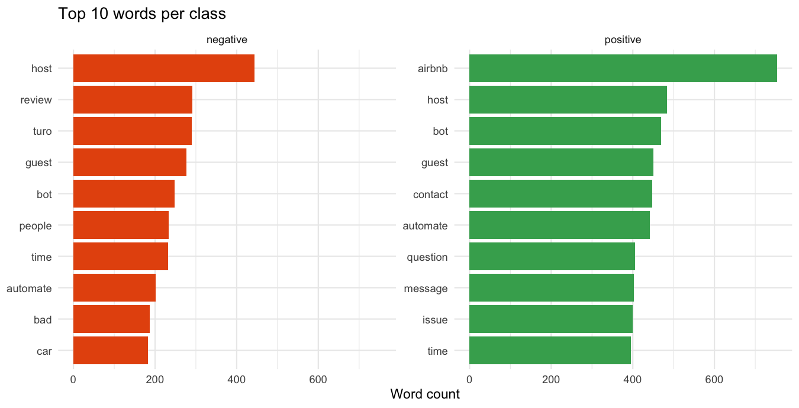
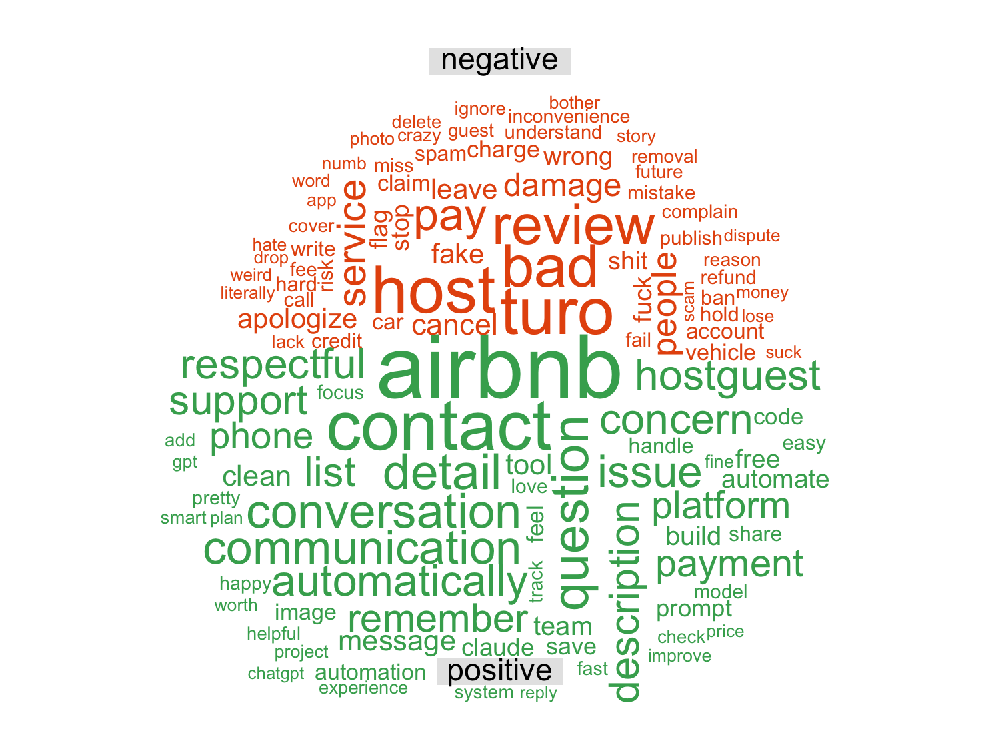
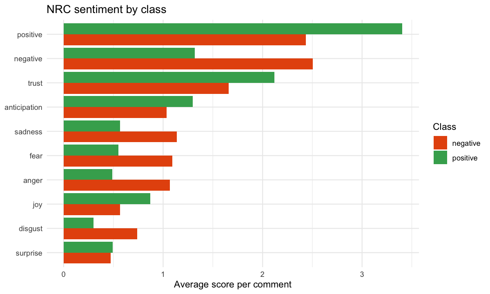
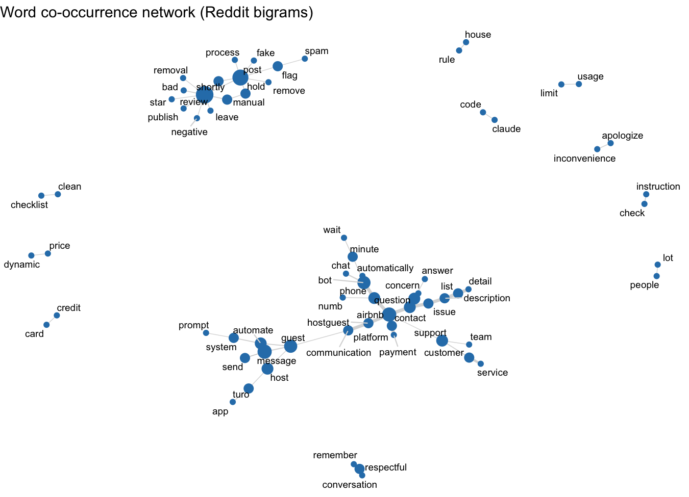
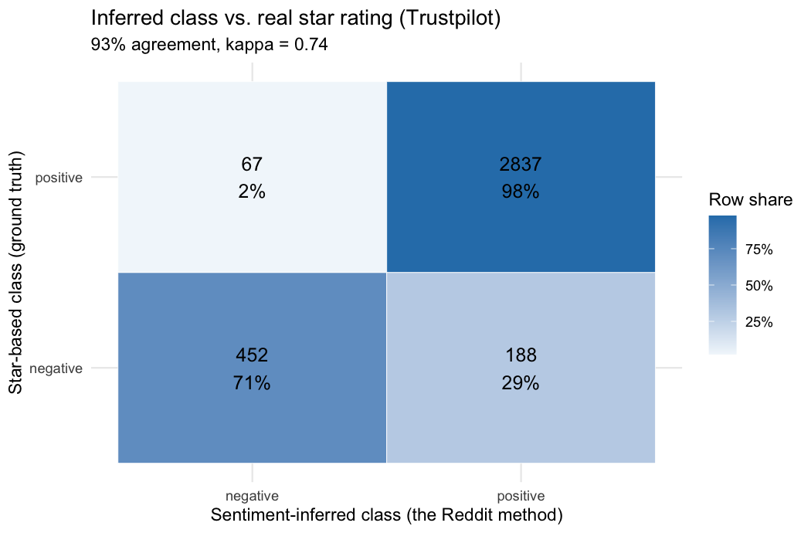
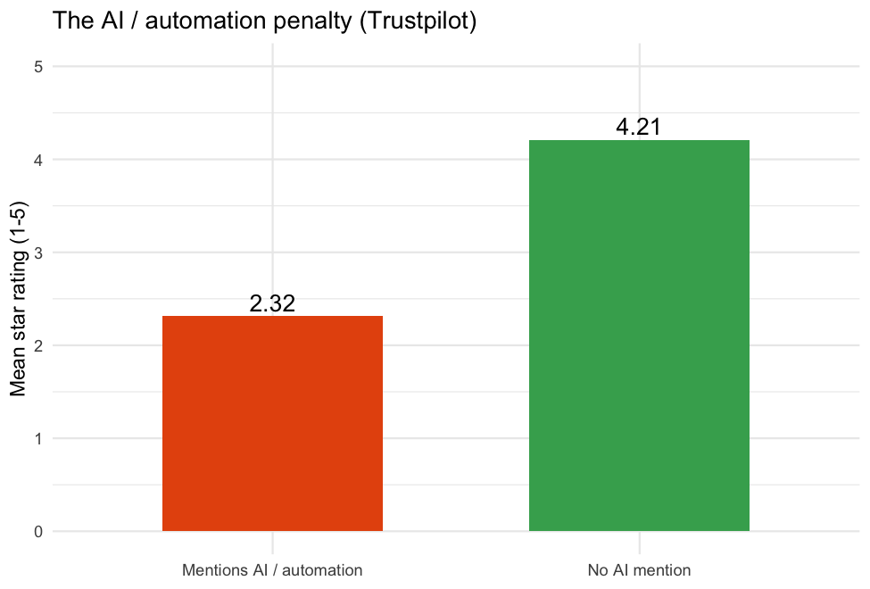
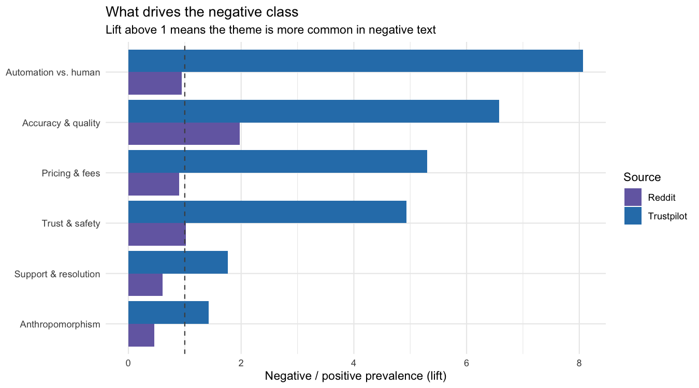

```{r setup, include=FALSE}
knitr::opts_chunk$set(echo = FALSE, warning = FALSE, message = FALSE,
                      fig.align = "center")
suppressPackageStartupMessages({ library(dplyr); library(knitr) })

safe_read <- function(p) if (file.exists(p))
  tryCatch(read.csv(p, stringsAsFactors = FALSE), error = function(e) NULL) else NULL

rd  <- safe_read("data/reddit_baseline.csv")
tp  <- safe_read("data/trustpilot_flagged.csv")
m   <- safe_read("outputs/metrics.csv")
rg  <- safe_read("outputs/role_gradient.csv")
rec <- safe_read("outputs/strategic_recommendations.csv")
dw  <- safe_read("outputs/negativity_drivers_wide.csv")
nb  <- safe_read("outputs/embeddings_neighbours.csv")

getm <- function(k) { if (is.null(m)) return("n/a")
  v <- m$value[m$metric == k]; if (length(v)) as.character(v[1]) else "n/a" }
rd_n   <- if (!is.null(rd)) nrow(rd) else NA
tp_n   <- if (!is.null(tp)) nrow(tp) else NA
rd_cat <- if (!is.null(rd)) as.list(table(rd$platform_category)) else list()
```

# The idea and research question

Online services increasingly place AI agents between the user and the thing
they came for. Chatbots answer support tickets, algorithms screen and price,
automated systems take decisions. We study how people accept or reject that AI,
and how acceptance changes with the role AI plays. We compare three service
contexts:

- **AI-native services**, where the product itself is an AI agent (ChatGPT,
  Claude, Replika, Gemini, Perplexity);
- **Peer-to-peer rentals**, where AI is an automation layer on a human
  marketplace (Turo, Airbnb, Fat Llama);
- **Customer service**, where AI runs the support layer (chatbots replacing
  agents).

The middle context is the assignment's core: a peer-to-peer sharing economy for
high-value professional gear such as cameras and drones (Fat Llama),
photography lenses (Lensrentals) and film and event kit (KitSplit), alongside
vehicles (Turo, Getaround) and RVs (Outdoorsy). The AI-native and
customer-service contexts act as comparison points that show how acceptance
shifts as AI moves from being the product, to a marketplace add-on, to the
support desk.

> **Research question.** How do users accept and experience AI agents across
> different service platforms, and what drives or erodes trust as AI moves from
> being the product, to a marketplace add-on, to the support desk?

Reddit is our discussion baseline, where users describe AI experiences in their
own words. Trustpilot is our verification layer, where every review carries a
1 to 5 star rating that acts as a ground-truth acceptance label. Where the open
discussion and the labelled reviews agree, we gain confidence. Where they
diverge, we learn something.

# The data

We collected two text sources and used no X or Twitter content.

**Reddit (baseline).** `r format(rd_n, big.mark=",")` comments from 12
subreddits (November 2023 to May 2026), collected from the
[Arctic Shift](https://github.com/ArthurHeitmann/arctic_shift) research archive
(`01_fetch_reddit_arcticshift.R`) because Reddit's 2026 anti-bot wall blocks
live scraping. AI-native subreddits are pulled in full; rental and support
subreddits are pulled by AI and automation keywords. Every comment carries a
`platform_category`: ai\_service `r rd_cat$ai_service`,
rental `r rd_cat$rental`, customer\_service `r rd_cat$customer_service`.

**Trustpilot (verification).** `r format(tp_n, big.mark=",")` reviews from seven
peer-to-peer rental platforms (Turo, Fat Llama, RVshare, Outdoorsy, Lensrentals,
Getaround, KitSplit), collected with an Apify actor and merged by
`02_merge_trustpilot.R`. Each review has a 1 to 5 star rating, and
`06_ai_acceptance.R` flags the ones that describe an AI or automation experience.

# Method

All analysis runs in one script, `analysis.R`, after data collection. Reddit is
mined in depth (steps 1 to 7) and Trustpilot enters as the verification layer
(steps 8 to 10). The two classes compared throughout are positive versus
negative acceptance: on Reddit inferred from a sentiment lexicon, on Trustpilot
read directly from the star rating. We picked methods we could apply
meaningfully to this question, and the pipeline covers every technique the brief
asks for.

```{r method-table}
method_tbl <- data.frame(
  Step = c("1  Preprocess + classes","2  Word frequency","3  Word clouds",
           "4  Sentiment","5  Co-occurrence network","6  Topic models (LDA)",
           "7  Word embeddings","8  Validation","9  Themes + role gradient"),
  Method = c("Lemmatise + AFINN lexicon split","Top-10 words per class",
             "Commonality + comparison, 1/2-gram","NRC eight emotions",
             "Bigram network (igraph, ggraph)","LDA, 4 topics per class, 1/2-gram",
             "GloVe word vectors","Inferred class vs star rating",
             "Shared theme tagging, both sources"),
  Why = c("Normalise text; build the two classes","What each class is about",
          "Shared vs distinctive words","Emotional texture beyond polarity",
          "Which words travel together","Latent themes per class",
          "Word meaning and neighbours","Test labels against real stars",
          "Frustrations and the role of AI"),
  check.names = FALSE)
kable(method_tbl, booktabs = TRUE, caption = "The analysis pipeline (one script, analysis.R).")
```

For the positive versus negative split we use the **AFINN lexicon**
([Nielsen, 2011](https://arxiv.org/abs/1103.2903)), which scores words from
minus 5 to plus 5; summing the scores in a comment and taking the sign gives its
class. The text mining follows the tidy-text approach of
[Silge and Robinson (2017)](https://www.tidytextmining.com/). AFINN downloads
once through the textdata package and is then cached.

# Findings

## What each class talks about (word frequency and clouds)

After normalising the text (lowercasing, removing punctuation, numbers and stop
words, then lemmatising to base words), we count the most frequent words in each
class. Frequency is the fastest read on what each class is about. The negative
class centres on *host, review, turo, guest, bot*; the positive class on
*airbnb, host, bot, guest, contact, automate* (Figure 1). Both classes are
dominated by rental-hosting vocabulary, since the rental subreddits are the
largest. The word *automate* appears in both classes: hosts praise the
automation that saves them time, and it also surfaces when automation
frustrates. The comparison cloud (Figure 2) shows the words that most separate
the two classes.

```{r fig-top, out.width="92%", fig.cap="Top 10 words per class."}

```

```{r fig-cloud, out.width="52%", fig.cap="Comparison cloud: words coloured by the class they belong to."}

```

## How the classes feel (sentiment)

The two classes are split by polarity, so to add information we score the
**NRC emotion lexicon**
([Mohammad and Turney, 2013](http://saifmohammad.com/WebPages/NRC-Emotion-Lexicon.htm)),
which tags words with eight emotions plus an overall polarity. The positive
class scores higher on trust, anticipation and joy; the negative class higher on
sadness, fear, anger and disgust (Figure 3). The gap is widest on **trust**,
which is the currency of a sharing economy.

```{r fig-nrc, out.width="78%", fig.cap="Average emotion words per comment, by class (NRC lexicon)."}

```

## How words connect (co-occurrence network)

Frequency lists lose structure, so we count adjacent word pairs (bigrams) and
draw the strongest as a network with igraph and ggraph. A network shows which
words travel together. The network falls into clear clusters (Figure 4): a
customer-support core (*customer, service, support, contact, question, issue*),
a bot cluster (*bot, phone, chat, automatically, wait*), a host-automation
cluster (*automate, message, guest, host, send*), and a review-moderation
cluster (*review, post, manual, flag, spam, publish*) that reflects Airbnb's
automated review handling.

```{r fig-net, out.width="93%", fig.cap="Word co-occurrence network of the strongest Reddit bigrams."}

```

## The latent topics (LDA)

Latent Dirichlet Allocation
([Blei, Ng and Jordan, 2003](https://www.jmlr.org/papers/v3/blei03a.html))
groups co-occurring words into topics. We fit four topics per class on unigrams
and bigrams, which summarises thousands of comments into a few readable subjects.
For the negative class (Table 2), Topic 1 is content and complaints (*people,
pay, model, post, write*), Topic 2 is bots and human support (*bot, customer,
human, question, call, agent, chat*), Topic 3 is Airbnb hosting and reviews
(*host, review, guest, airbnb, automate*), and Topic 4 is Turo car rentals
(*turo, car, app, service, cancel*). Bots, support and reviews recur across
topics.

```{r lda-table}
lda_neg <- safe_read("outputs/lda_negative_unigram.csv")
if (!is.null(lda_neg)) kable(lda_neg, booktabs = TRUE,
  caption = "LDA topics for the negative class (top terms per topic).")
```

## The meaning behind words (embeddings)

Lexicon and topic methods ignore meaning. **GloVe** word embeddings
([Pennington, Socher and Manning, 2014](https://nlp.stanford.edu/projects/glove/))
place words in a vector space learned from the corpus, so we can read the
nearest neighbours of key terms. The vectors independently rediscover the
human-versus-automation tension at the heart of the project:

```{r embed-list, results='asis'}
if (!is.null(nb)) for (i in seq_len(nrow(nb)))
  cat(sprintf("- **%s**: %s\n", nb$term[i], nb$neighbours[i]))
```

The neighbours of *human* (agent, support, interaction, actual, need) point to
users wanting a real person, while *bot* sits among contact channels
(automatically, phone, contact, chat, issue).

## Does the inferred class hold up? (validation)

Reddit has no ground-truth label, so the positive or negative class is
*inferred* from sentiment. Trustpilot has both text and a star rating, so it is
where we can test that inference: we apply the same lexicon class to Trustpilot
and compare it to the star-based class. Agreement is
**`r getm("validity_agreement_pct")`%** (Cohen's
$\kappa$ = `r getm("validity_kappa")`,
n = `r format(as.numeric(getm("validity_n")), big.mark=",")`), which is
substantial by the usual benchmark, and the lexicon recovers about 71% of
genuinely negative reviews (Figure 5). This is the bridge that lets us read the two
corpora together with confidence.

```{r fig-val, out.width="60%", fig.cap="Inferred class vs. the real star rating on Trustpilot."}

```

## The big pattern (the role of AI)

With the method validated, we tag both corpora with the same six themes and
measure acceptance by AI's role. On Reddit the three contexts are close, with
AI-native services slightly the most positive:

```{r role-table}
if (!is.null(rg)) {
  r <- rg |> transmute(
    `Context` = recode(platform_category,
        ai_service = "AI-native (the product)",
        customer_service = "Customer service (support desk)",
        rental = "Rental (a marketplace add-on)"),
    Comments = n, `Positive share` = paste0(round(100 * pct_positive), "%")) |>
    arrange(desc(`Positive share`))
  kable(r, booktabs = TRUE, caption = "Reddit: positive-class share by the role of AI.")
}
```

The decisive role signal is on Trustpilot: rental reviews that mention AI or
automation average **`r getm("ai_star")` stars** against
**`r getm("non_ai_star")`** for the rest, a **`r getm("ai_penalty")`-star** gap
(Figure 6). Figure 7 shows the theme drivers, with an honest split: *accuracy*
and *trust* drive the negative class in **both** sources, while *automation* and
*support* spike on Trustpilot but lean positive on Reddit. That divergence is
itself a finding: Reddit skews toward hosts and builders who value automation,
Trustpilot toward end customers who resent it. Same technology, opposite
reception, depending on who meets it and whether they chose it.

```{r fig-penalty, out.width="55%", fig.cap="The AI and automation penalty on Trustpilot."}

```

```{r fig-drivers, out.width="92%", fig.cap="Themes that drive the negative class. Lift above 1 means more common in negative text."}

```

# Key differences between the two classes

Across the methods, the two classes separate along one axis: whether the
automation **helps** the user or **blocks** them.

| Positive class | Negative class |
|---|---|
| Automation that works, successful hosting | Accuracy problems and things that "don't work" |
| Trust, joy, anticipation | Anger, fear, sadness, disgust |
| AI as a tool the user runs | AI as a barrier between the user and a person |
| Automation was **chosen** | Automation was **imposed** |

Acceptance is high when the user runs the automation themselves and can still
reach a human; it falls when automation stands in the way. This is the practical
meaning of *algorithm aversion*
([Dietvorst, Simmons and Massey, 2015](https://doi.org/10.1037/xge0000033)):
people accept AI for tasks they see as mechanical and resist it for tasks they
see as needing human judgement.

# Strategic recommendations

The evidence converts into a short, ordered list of design rules. They are
written for a product or marketing team deciding how an AI agent should behave.

```{r recs, results='asis'}
if (!is.null(rec)) {
  rec <- rec |> arrange(priority)
  for (i in seq_len(nrow(rec)))
    cat(sprintf("%d. **%s.** %s\n\n", rec$priority[i],
                rec$recommendation[i], rec$evidence[i]))
}
```

The first rule matters most. On the customer side (Trustpilot) the strongest
signal is that being trapped with a bot, unable to reach a person, destroys
acceptance. On Reddit, where many users host or build with AI, the same
automation is valued, so the lesson is about who meets the AI and whether they
chose it. An AI agent should be **transparent** (labelled as AI, honest about
limits), **escapable** (a human is one click away) and **role-matched**
(personable when it is the product, efficient and unobtrusive when it is a
transactional add-on).

# Methods, tools and limitations

The analysis is written in R. Preprocessing uses tidytext and textstem;
sentiment uses the AFINN and NRC lexicons (via tidytext and syuzhet); the network
uses igraph and ggraph; topic models use topicmodels; embeddings use text2vec.
The report is fully reproducible: `analysis.R` regenerates every figure and
table that appears here (the AFINN lexicon downloads once through textdata).

A few limits are worth stating plainly:

- Trustpilot reviews skew positive, which is typical of opt-in review sites.
- Lexicon sentiment is an approximation of the class, so the inferred labels are
  a coarse instrument; the `r getm("validity_agreement_pct")`% agreement with
  stars shows it is good enough for classification, but exact magnitudes should
  be read as directional.
- The Trustpilot side covers rentals only, so the AI-native end of the role
  gradient rests on Reddit. The rental contrast, the core of the sharing economy,
  is the part validated across both sources.
- Trust appears mostly implicitly (bot or human, automated, algorithm), so we
  read it through themes and emotion rather than the literal word. English only.

# References

\footnotesize

Blei, D. M., Ng, A. Y., and Jordan, M. I. (2003). Latent Dirichlet Allocation.
*Journal of Machine Learning Research*, 3, 993 to 1022.
<https://www.jmlr.org/papers/v3/blei03a.html>

Davis, F. D. (1989). Perceived usefulness, perceived ease of use, and user
acceptance of information technology. *MIS Quarterly*, 13(3), 319 to 340.

Dietvorst, B. J., Simmons, J. P., and Massey, C. (2015). Algorithm aversion.
*Journal of Experimental Psychology: General*, 144(1), 114 to 126.
<https://doi.org/10.1037/xge0000033>

Nielsen, F. Å. (2011). A new ANEW: evaluation of a word list for sentiment
analysis in microblogs. *Proceedings of the ESWC Workshop on Making Sense of
Microposts*. <https://arxiv.org/abs/1103.2903>

Mohammad, S. M., and Turney, P. D. (2013). Crowdsourcing a word-emotion
association lexicon. *Computational Intelligence*, 29(3), 436 to 465.
<http://saifmohammad.com/WebPages/NRC-Emotion-Lexicon.htm>

Pennington, J., Socher, R., and Manning, C. D. (2014). GloVe: Global vectors for
word representation. *Proceedings of EMNLP*.
<https://nlp.stanford.edu/projects/glove/>

Silge, J., and Robinson, D. (2017). *Text Mining with R: A Tidy Approach.*
O'Reilly Media. <https://www.tidytextmining.com/>

\normalsize

---

\footnotesize
Repository: <https://github.com/tyomachkaa/ai-acceptance-sharing-economy> .
Online Content Analysis, WU Vienna, 2026.
